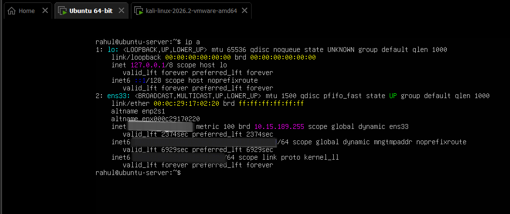
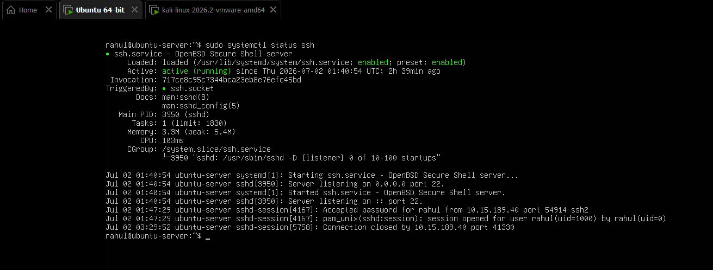
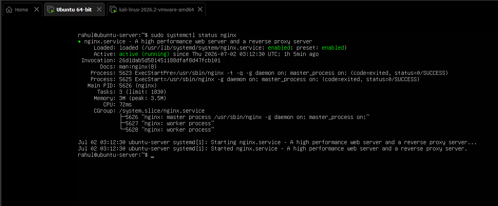
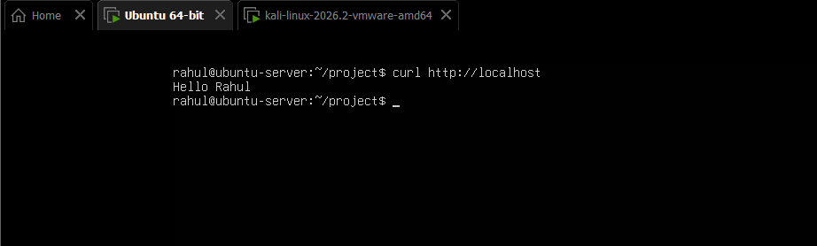
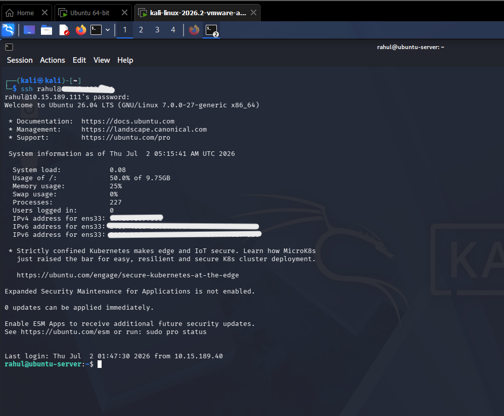
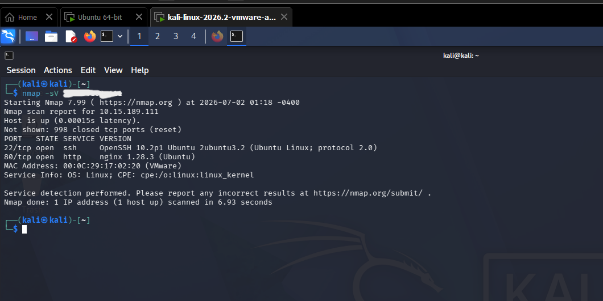
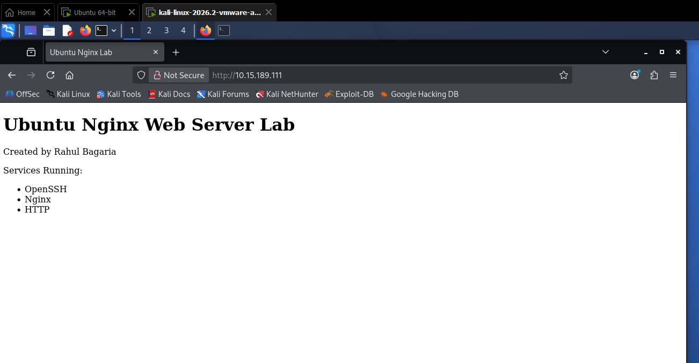

<div align="center">

# 🚀 Ubuntu Nginx Web Server Lab

### Linux System Administration • Ubuntu Server • Nginx • SSH • VMware • Kali Linux


---

**A hands-on Linux Administration Home Lab simulating a real-world Ubuntu Server deployment with Nginx, SSH, and network verification using Kali Linux.**

</div>

---

# 📌 Executive Summary

This project demonstrates the deployment, configuration, and administration of an Ubuntu Server inside a VMware Workstation virtual environment.

The primary objective was to simulate a small production-like Linux environment by deploying an Nginx web server, enabling secure remote administration using OpenSSH, and validating the deployment from a Kali Linux client using industry-standard networking tools.

The project focuses on practical Linux administration tasks commonly performed by Linux Administrators, NOC Engineers, and Junior System Administrators.

---

# 🎯 Project Objectives

- Deploy Ubuntu Server in VMware Workstation
- Configure network connectivity
- Install and configure Nginx Web Server
- Configure OpenSSH Server
- Deploy a custom HTML webpage
- Validate HTTP service using Curl
- Establish secure remote administration via SSH
- Verify running services using Nmap
- Practice Linux system administration fundamentals

---

# 🖥️ Lab Environment

| Component | Technology |
|------------|----------------|
| Hypervisor | VMware Workstation |
| Server Operating System | Ubuntu Server 26.04 LTS |
| Client Operating System | Kali Linux |
| Web Server | Nginx |
| Remote Access | OpenSSH |
| Browser | Firefox |
| Network Tools | Nmap, Curl |
| Shell | Bash |

---

# 🌐 Network Architecture

```text
                 VMware Workstation

         ┌────────────────────────────┐
         │                            │
         │      Ubuntu Server         │
         │                            │
         │ Ubuntu Server 26.04 LTS    │
         │ OpenSSH                    │
         │ Nginx                      │
         │ Static Website             │
         └─────────────┬──────────────┘
                       │
                HTTP (80)
                 SSH (22)
                       │
         ┌─────────────┴──────────────┐
         │                            │
         │        Kali Linux          │
         │                            │
         │ Firefox                    │
         │ SSH Client                 │
         │ Nmap                       │
         └────────────────────────────┘
```

---

# 📂 Repository Structure

```text
ubuntu-nginx-web-server-lab
│
├── README.md
│
└── screenshots
    ├── 01-ubuntu-server.png
    ├── 02-ubuntu-ip.png
    ├── 03-nginx-status.png
    ├── 04-ssh-status.png
    ├── 05-project-structure.png
    ├── 06-website-content.png
    ├── 07-curl-test.png
    ├── 08-kali-ip.png
    ├── 09-ssh-login.png
    ├── 10-nmap-scan.png
    └── 11-browser-output.png
```

---

# 🏗️ Technologies Used

| Category | Technology |
|------------|----------------|
| Virtualization | VMware Workstation |
| Operating System | Ubuntu Server |
| Client Machine | Kali Linux |
| Web Server | Nginx |
| Remote Administration | OpenSSH |
| Networking | TCP/IP |
| Service Management | systemd |
| Utilities | Curl |
| Network Scanning | Nmap |
| Text Editor | Nano |
| Shell | Bash |

---

# ⭐ Key Features

✅ Ubuntu Server Deployment

✅ Nginx Web Server Configuration

✅ Secure Remote Administration

✅ SSH Connectivity

✅ HTTP Service Verification

✅ Linux Service Management

✅ Network Enumeration

✅ Linux Administration Practice

---

# ⚙️ Project Implementation

This section explains the complete deployment process followed during the implementation of the Ubuntu Nginx Web Server Lab.

---

# Step 1 — Ubuntu Server Deployment

Ubuntu Server 26.04 LTS was deployed inside VMware Workstation using the default installation options.

### Tasks Performed

- Installed Ubuntu Server
- Created an administrative user
- Updated the operating system
- Verified network connectivity

### Commands

```bash
sudo apt update
sudo apt upgrade -y
```

---

# Step 2 — Network Verification

After installation, the assigned IP address was verified.

### Commands

```bash
ip a

hostname -I
```

### Verification Screenshot



---

# Step 3 — Installing OpenSSH Server

OpenSSH Server was installed to allow secure remote administration from Kali Linux.

### Installation

```bash
sudo apt install openssh-server -y
```

### Enable Service

```bash
sudo systemctl enable ssh

sudo systemctl start ssh
```

### Verify Service

```bash
sudo systemctl status ssh
```

### Screenshot



---

# Step 4 — Installing Nginx

Nginx was installed as the web server to host a static website.

### Installation

```bash
sudo apt install nginx -y
```

### Enable Service

```bash
sudo systemctl enable nginx

sudo systemctl start nginx
```

### Verify Service

```bash
sudo systemctl status nginx
```

### Screenshot



---

# Step 5 — Website Deployment

A simple HTML webpage was created and deployed to the default Nginx document root.

### HTML Deployment

```bash
sudo cp website/index.html /var/www/html/index.html
```

### Verify

```bash
cat /var/www/html/index.html
```

### Screenshot


---

# Step 6 — Local HTTP Verification

The hosted webpage was verified locally using Curl.

### Command

```bash
curl http://localhost
```

### Expected Result

```
Ubuntu Nginx Web Server Lab
```

### Screenshot



---

# Step 7 — Remote SSH Administration

A secure remote SSH connection was established from Kali Linux.

### Command

```bash
ssh rahul@10.15.189.111
```

### Validation

Successful login confirmed that the SSH service was accessible across the network.

### Screenshot



---

# Step 8 — Network Service Enumeration

Nmap was used to identify the running services on the Ubuntu Server.

### Command

```bash
nmap -sV 10.15.189.111
```

### Services Detected

| Port | Service |
|------|----------|
| 22 | OpenSSH |
| 80 | Nginx HTTP |

### Screenshot



---

# Step 9 — Browser Verification

The hosted webpage was successfully accessed from the Kali Linux browser.

### URL

```
http://10.15.189.111
```

### Screenshot



---

# 📊 Validation Summary

| Test | Status |
|------|--------|
| Ubuntu Installation | ✅ PASS |
| Network Configuration | ✅ PASS |
| OpenSSH Service | ✅ PASS |
| Nginx Service | ✅ PASS |
| HTTP Access | ✅ PASS |
| SSH Login | ✅ PASS |
| Browser Verification | ✅ PASS |
| Nmap Scan | ✅ PASS |

---

# 🛠️ Skills Demonstrated

This project demonstrates practical skills commonly required for Linux Administrator, NOC Engineer, and Junior System Administrator roles.

| Domain | Skills |
|---------|--------|
| Linux Administration | Ubuntu Server Installation, User Management, Service Management |
| Web Server | Nginx Installation & Configuration |
| Remote Administration | OpenSSH Configuration |
| Networking | IP Addressing, HTTP, SSH, TCP/IP |
| Service Management | systemctl |
| Network Troubleshooting | Curl, Nmap |
| Virtualization | VMware Workstation |
| Command Line | Bash, Nano, Linux CLI |

---

# 💻 Linux Commands Used

### System Information

```bash
hostnamectl
hostname -I
ip a
whoami
pwd
```

### Package Management

```bash
sudo apt update
sudo apt upgrade -y
sudo apt install nginx
sudo apt install openssh-server
```

### Service Management

```bash
sudo systemctl start nginx
sudo systemctl stop nginx
sudo systemctl restart nginx
sudo systemctl status nginx

sudo systemctl start ssh
sudo systemctl enable ssh
sudo systemctl status ssh
```

### Network Testing

```bash
curl http://localhost

ssh rahul@10.15.189.111

nmap -sV 10.15.189.111
```

---

# 📈 Learning Outcomes

Through this project I gained practical experience in:

- Deploying Ubuntu Server
- Linux package management
- Managing Linux services
- Configuring OpenSSH
- Deploying websites using Nginx
- Linux command-line administration
- Remote server administration
- Network troubleshooting
- Basic web hosting
- Service verification using Nmap

---

# 🔒 Security Considerations

The following security practices were followed during the lab:

- SSH used for secure remote administration
- Services verified before deployment
- Ubuntu package updates applied
- Local lab environment isolated using VMware
- Nmap used only for validating lab services

> **Note:** This project was performed entirely inside a private virtual lab for educational and portfolio purposes.

---

# 🚀 Future Improvements

The next planned improvements for this lab include:

- Configure UFW Firewall
- SSH Hardening
- Disable Root Login
- Password Authentication Hardening
- Fail2Ban
- Nginx Virtual Hosts
- HTTPS using Let's Encrypt
- Log Monitoring
- Automated Backups
- Docker Deployment
- Reverse Proxy Configuration

---

# 📷 Project Gallery

| Screenshot | Description |
|------------|-------------|
| Ubuntu Server | screenshots/01-ubuntu-server.png |
| Network Configuration | screenshots/02-ubuntu-ip.png |
| Nginx Status | screenshots/03-nginx-status.png |
| SSH Status | screenshots/04-ssh-status.png |
| Project Structure | screenshots/05-project-structure.png |
| Website Source | screenshots/06-website-content 2.png |
| Curl Verification | screenshots/07-curl-test.png |
| Kali Linux | screenshots/08-kali-ip.png |
| SSH Login | screenshots/09-ssh-login.png |
| Nmap Scan | screenshots/10-nmap-scan.png |
| Browser Verification | screenshots/11-browser-output.png |

---

# 💼 Resume Highlights

This project demonstrates practical experience with:

- Ubuntu Server Administration
- Linux Service Management
- OpenSSH
- Nginx
- VMware
- Linux Networking
- Network Troubleshooting
- Basic Web Hosting

Suitable for entry-level roles such as:

- Linux Administrator
- NOC Engineer
- Technical Support Engineer
- Infrastructure Support Engineer
- Junior System Administrator

---

# 👨‍💻 About Me

I'm **Rahul Bagaria**, an aspiring Linux Administrator and Network Engineer with a strong interest in Linux, networking, infrastructure, and cybersecurity.

I enjoy building home labs to gain hands-on experience with enterprise technologies and continuously improve my practical skills.

---

# 📬 Connect With Me

**GitHub**

https://github.com/rahulbagaria91

**LinkedIn**

https://www.linkedin.com/in/rahulbagaria91/


---

# ⭐ Support

If you found this project useful, consider giving it a ⭐ on GitHub.

Feedback and suggestions are always welcome.

---

