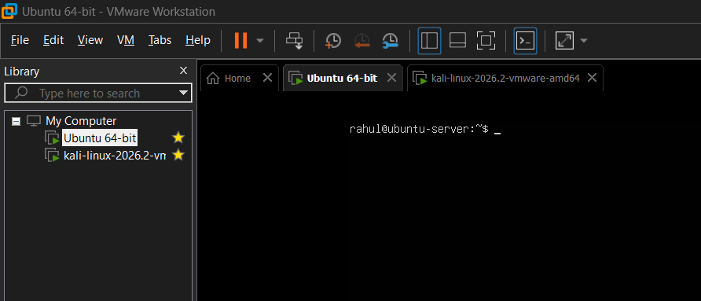
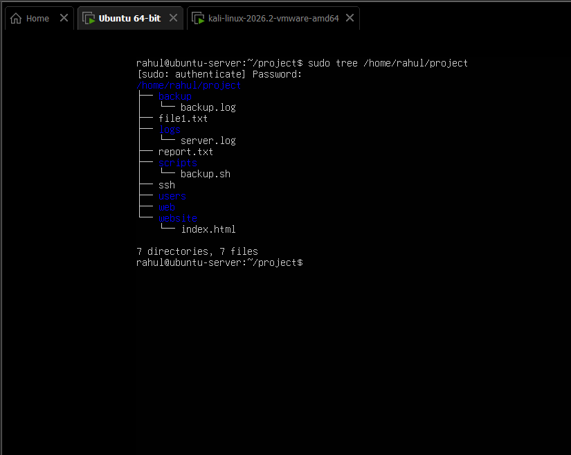
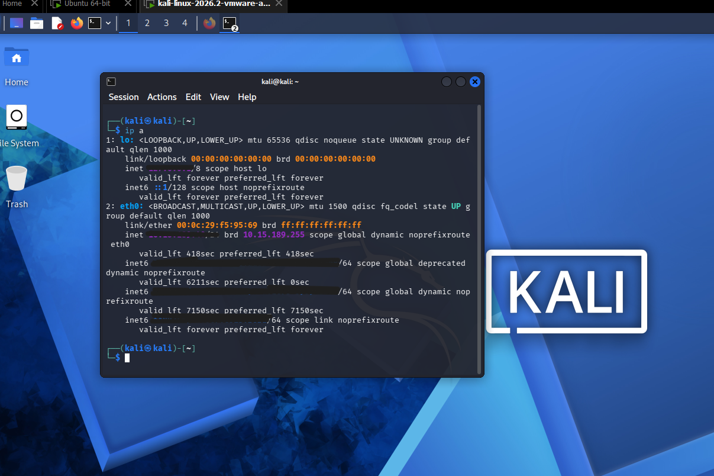

# 🚀 Ubuntu Nginx Web Server Lab

> A hands-on Linux System Administration home lab demonstrating Ubuntu Server deployment, Nginx web server configuration, SSH remote access, and network verification using Kali Linux.

---

## 📌 Project Overview

This project simulates a real-world Linux server environment using VMware Workstation. An Ubuntu Server was deployed and configured with the Nginx web server and OpenSSH service. The deployed web application was validated locally and remotely from Kali Linux using HTTP, SSH, and Nmap.

---

## 🎯 Objectives

- Deploy Ubuntu Server inside VMware Workstation
- Install and configure Nginx Web Server
- Configure OpenSSH for remote administration
- Deploy a custom HTML webpage
- Verify HTTP service using Curl
- Connect remotely using SSH
- Perform network reconnaissance using Nmap
- Practice Linux system administration

---

# 🖥️ Lab Environment

| Component | Details |
|-----------|---------|
| Hypervisor | VMware Workstation |
| Server OS | Ubuntu Server 26.04 LTS |
| Client OS | Kali Linux 2026 |
| Web Server | Nginx |
| Remote Access | OpenSSH |
| Tools | Nmap, Curl, SSH |

---

# 🌐 Network Topology

```
                    VMware Workstation

        +--------------------------------+
        |                                |
        |        Ubuntu Server           |
        |--------------------------------|
        | Ubuntu 26.04 LTS               |
        | Nginx Web Server               |
        | OpenSSH                        |
        | Static Website                 |
        +---------------+----------------+
                        |
               HTTP (80) | SSH (22)
                        |
        +---------------+----------------+
        |            Kali Linux          |
        |--------------------------------|
        | Firefox Browser                |
        | SSH Client                     |
        | Nmap                           |
        +--------------------------------+
```

---

# 📂 Project Structure

```text
project/
├── backup/
│   └── backup.log
├── logs/
│   └── server.log
├── scripts/
│   └── backup.sh
├── website/
│   └── index.html
├── file1.txt
├── report.txt
├── ssh
├── users
└── web
```

---

# ⚙️ Implementation Steps

### 1. Ubuntu Server Installation

- Installed Ubuntu Server 26.04 LTS
- Verified network connectivity
- Assigned IP Address

---

### 2. Nginx Installation

```bash
sudo apt update
sudo apt install nginx -y
sudo systemctl enable nginx
sudo systemctl start nginx
```

---

### 3. SSH Configuration

```bash
sudo apt install openssh-server -y
sudo systemctl enable ssh
sudo systemctl start ssh
```

---

### 4. Website Deployment

Created a custom HTML webpage and deployed it to the default Nginx web directory.

```bash
sudo cp website/index.html /var/www/html/index.html
```

---

### 5. Service Verification

```bash
sudo systemctl status nginx
sudo systemctl status ssh
```

---

### 6. HTTP Verification

```bash
curl http://localhost
```

---

### 7. Remote SSH Access

```bash
ssh rahul@10.15.189.111
```

---

### 8. Network Enumeration

```bash
nmap -sV 10.15.189.111
```

---

# ✅ Validation Results

| Test | Status |
|------|--------|
| Ubuntu Installation | ✅ PASS |
| IP Configuration | ✅ PASS |
| Nginx Service | ✅ PASS |
| SSH Service | ✅ PASS |
| Website Deployment | ✅ PASS |
| HTTP Response | ✅ PASS |
| SSH Login | ✅ PASS |
| Nmap Scan | ✅ PASS |

---

# 📷 Project Screenshots

## Ubuntu Server



---

## IP Configuration


---

## Nginx Service Status


---

## SSH Service Status


---

## Project Structure



---

## Website Source Code


---

## Curl Verification


---

## Kali Linux Network



---

## SSH Login from Kali


---

## Nmap Service Detection


---

## Browser Output


---

# 💻 Commands Used

## Network

```bash
ip a
hostname -I
```

## Services

```bash
sudo systemctl status nginx
sudo systemctl status ssh
```

## Web

```bash
curl http://localhost
```

## SSH

```bash
ssh rahul@10.15.189.111
```

## Enumeration

```bash
nmap -sV 10.15.189.111
```

---

# 🛠 Skills Demonstrated

- Linux Administration
- Ubuntu Server Management
- Nginx Configuration
- OpenSSH Configuration
- VMware Virtualization
- TCP/IP Networking
- HTTP Protocol
- Remote Server Administration
- Linux File Permissions
- Service Management (systemd)
- Network Enumeration
- Basic Web Hosting

---

# 🚀 Future Improvements

- Configure UFW Firewall
- Enable HTTPS using SSL/TLS
- Configure Nginx Virtual Hosts
- Automate Backups using Bash
- Log Monitoring
- Fail2Ban Integration
- Reverse Proxy Configuration

---

# 👨‍💻 Author

**Rahul Bagaria**

Aspiring Network Engineer | Linux Administrator | NOC Engineer | Cyber Security Enthusiast

- **GitHub:** https://github.com/rahulbagaria91
- **LinkedIn:** https://www.linkedin.com/in/rahulbagaria91

---

⭐ If you found this project useful, consider giving it a star!